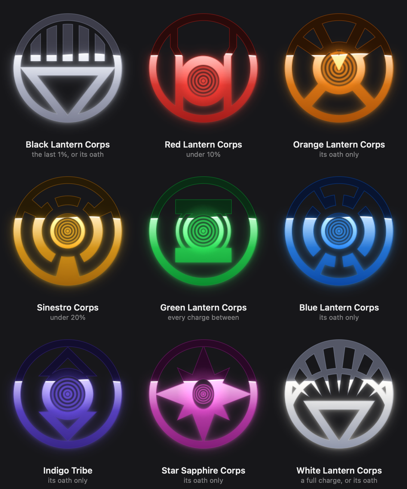
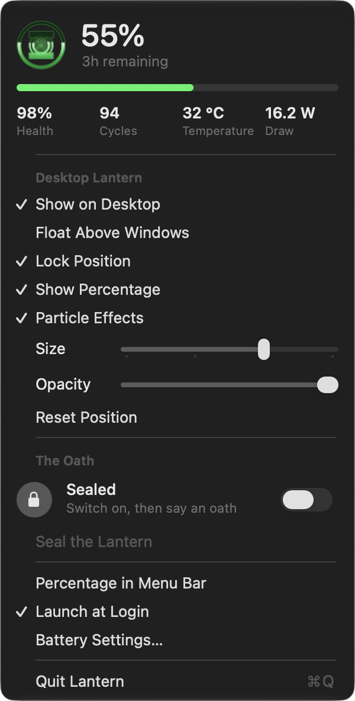

# Lantern

A native macOS battery gauge shaped like a Lantern Corps emblem. It lives on
your desktop, fills from the bottom as charge drains, and runs a charging
animation when you plug in.

**Nine corps, and the emblem changes with the charge**: white at a full
battery, green through the middle, Sinestro yellow under 20%, red under 10%,
black at the last 1%. Four more — orange, blue, indigo and Star Sapphire —
answer only to their spoken oath. Each has its own figure, palette, arrival
animation and particle behaviour, and every one is drawn in code from
measurements rather than shipped as artwork.



## Build & run

```bash
./build.sh
open build/Lantern.app
```

Needs only the Xcode Command Line Tools — there's no Xcode project. `build.sh`
compiles the sources, writes `Info.plist`, renders the app icon, and ad-hoc
signs the bundle.

## What it does

**On the desktop.** A transparent, borderless panel draws the emblem. By
default it sits at the desktop-icon window level, so it rests on the wallpaper
behind your real windows. It shows on every Space and never steals focus.

**Reading the charge.** The emblem is the vessel; charge fills it from the
bottom with a moving liquid surface. Green normally, amber under 20%, red
under 10% — and below 20% the whole emblem breathes so it catches your eye.

The figure inside the ring changes with the colour, so the emblem tells you
which corps the light belongs to. Amber under 20% gives the Sinestro Corps
emblem — a bordered hub, a middle band broken in four places, and three arms
carrying that band out to the ring. Red under 10% gives the Red Lantern Corps one — two straight bars
down the flanks, each jogging outward partway up, around a hub that sits low.

At the two ends of the charge the emblem leaves the spectrum altogether.
Under 1% — when the number itself reads 1 or 0 — the light goes out and the
**Black Lantern** takes it: five bars across the top under a dome, and an
inverted triangle below. At a full charge, plugged in or not, the **White
Lantern** has it instead: seven spikes fanning out of the middle, a crescent
beneath them, and the same triangle.

Neither is drawn at its literal extreme. The black one is cold greys, not true
black, and the white one is kept just off white with an ember light enough to
survive a pale wallpaper. An emblem at either extreme is one you can't see on
half the desktops it might sit on — and 1% is exactly when you want to see it.

Four corps exist that **no charge can reach**: the Orange Lantern, a spoked
wheel with a chevron at its heart; the Blue Lantern, built like the Sinestro
emblem but with six breaks in its band and four finer arms; the Star Sapphire,
which is no lantern at all but an eight-pointed star with an upright ellipse
cut out of its middle; and the Indigo Tribe, a bordered hub with a chevron
above it and another below. Avarice isn't something a battery falls into, hope
isn't something it hands you, and love and compassion certainly aren't. All
four are taken — only their oaths get you there.

**Changing corps.** Crossing a threshold isn't a swap — every piece of the
artwork dissolves from one figure and palette into the next, and the corps
being *entered* throws its own flourish over the top:

- **Sinestro yellow** arrives as fear: the green light stutters out in hard,
  uneven cuts, the emblem flinches, and the yellow takes hold behind a single
  ring.
- **Red Lantern red** arrives as a blow: the emblem kicks, shudders sideways,
  and throws three hard rings and a burst out of the hub.
- **Orange Lantern orange** arrives as a grab: the emblem clenches down hard,
  then throws itself open wider than it rests. It is the quickest of the four —
  greed doesn't wait — and it never shudders, which is what tells it apart from
  the red.
- **Black Lantern grey** arrives as a death. Nothing flares: the lantern falls
  dark, sinks, and what comes back is already black. It is the slowest of the
  six, and the only one that **snuffs** the bloom instead of spiking it.
- **White Lantern white** arrives as a dawn, and is the black's exact opposite:
  a long swell, three unhurried rings, and a bloom held up at its ceiling. It
  is the only arrival that ends brighter than the lantern ever rests.
- **Blue Lantern blue** doesn't arrive so much as lift: the lantern rises a
  little, brightens, and settles back. It is the only flourish that moves the
  emblem off its centre without shaking it.
- **Star Sapphire violet** arrives as a heartbeat — two beats, the second
  softer, with a ring thrown on each. Nothing else in the set pulses twice.
- **Indigo** barely moves the lantern at all. It holds nearly still and lets
  three rings go out from it, evenly spaced rather than thrown: every other
  flourish is something happening *to* the emblem, and this one is something
  leaving it.
- **Green** arrives as a restoration: no violence, just one slow swell and a
  single ring as the lantern settles.

Direction doesn't matter — charging back up, or swearing an oath, plays the
flourish of whichever corps the light lands in.

**An oath doesn't throw its own flare over the top of one.** The oath flare and
the corps flourish draw on the same layers under the same keys, and the oath
lands second, so it used to replace whatever the arriving corps had thrown: the
Indigo Tribe's three slow rings, the Star Sapphire's two on its heartbeats, the
Black Lantern's bloom, which it *snuffs* rather than spikes. For the four corps
an oath is the only way into, that happened every single time. The oath now
adds only its particle burst when a corps has just flourished, and fires its
own rings and flare only when the oath didn't change the corps — swearing the
Green oath while already green, say.

See it without draining a battery:

```bash
build/Lantern.app/Contents/MacOS/Lantern --demo-shift 4 0.25
```

That walks the levels either side of both thresholds in a window of its own,
then the oaths — each corps sworn over a charge that would have chosen a
different one, and released again. The second argument scales Core Animation's
clock for the emblem, so the same transitions can be watched slowly; the
motion is unchanged, only its rate.

**Particles.** The lantern's energy is particles, with different behaviour per
state: motes come off the charge it's holding, streaks stream in and spiral
into the hub while charging (the hub flickers as it swallows them), streaks
stall and fade short of the hub while the lantern is sealed, and the oath
throws a burst outward. They're Core Animation emitters, so they cost the app
nothing. Turn them off with **Particle Effects** in the menu.

**Each corps' light behaves as its own.** The motes coming off the charge are
the corps, not the colour of one:

| | |
|---|---|
| Green | willpower: disciplined, rising evenly. The baseline the others are written against |
| Sinestro | fear: flung every which way, guttering out almost as fast as it appears, and more of it than anything but the white |
| Red | rage: spat out hard as streaks and pulled straight back down — it arcs and falls rather than rising |
| Orange | avarice: nothing is allowed to leave. The motes barely clear the charge before they're hauled back into it |
| Blue | hope: slow, orderly, buoyant. It rises further than any other and takes its time fading |
| Indigo | compassion: given away rather than given off, leaving in every direction at once and weighing nothing |
| Star Sapphire | love: crystalline. It drifts wide and slow, and over half of it is the whiter cell, so it reads as facets catching light |
| Black | death: it doesn't rise at all. What comes off sinks away, slowly, and hardly brightens on the way |
| White | life: all of it at once — the most, the fastest, the brightest |

One table of constants drives it, with the Green Lantern's values as the
defaults; every other corps states only what it differs in. Below 2% charge
there are no motes at all whatever the corps, which is why the Black Lantern
gives off nothing when the *battery* puts you there — only when its oath does.

**Charging animation.** Plugging in triggers, in order:

- a bright flare that blooms and settles over ~1.5s
- motes of charge drifting up through the emblem, swaying as they rise
- a band of light climbing the emblem on a ~2.1s loop
- a comet of light running around the outer ring
- the fill level breathing slightly above its true value

At 100% and still plugged in, the comet becomes a slow shimmer.

**Menu bar.** At 19pt the fine detail falls under a pixel, so every figure has
a coarser fallback below `LanternGlyph.detailThreshold` — thicker rings, wider
gaps, dropped brackets. Magnified, all nine:


A miniature of the same emblem, optionally with the
percentage. The menu follows Apple's own menu-bar extras: a header card with
the lantern, the charge in large rounded figures, a charge bar in the lantern's
colour, and a row of vitals — health, cycles, temperature, and power in or out;
section headings; Size and Opacity as sliders; and the oath as a Control
Center-style row with a switch for listening. Custom rows use system fonts and
semantic colours, so they follow light and dark mode. (This macOS draws no
icons on plain menu items, so the menu doesn't try.)



## The Oaths

Three corps, three oaths. Say one and the lantern flares — a shockwave, a
bloom spike, the sealed lantern opens — and **swears to that corps**: it
dissolves into that figure and colour and stays there, whatever the battery
says, until you seal it again.

> **Green Lantern Corps.** In brightest day, in blackest night, no evil shall
> escape my sight. Let those who worship evil's might beware my power — Green
> Lantern's light!

> **Sinestro Corps.** In blackest day, in brightest night, beware your fears
> made into light. Let those who try to stop what's right, burn like my
> power — Sinestro's might!

> **Red Lantern Corps.** With blood and rage of crimson red, ripped from a
> corpse so freshly dead, together with our hellish hate, we'll burn you all —
> that is your fate!

> **Orange Lantern Corps.** What's mine is mine, and mine, and mine. And mine
> and mine and mine! Not yours!

> **Black Lantern Corps.** The Blackest Night falls from the skies, the
> darkness grows as all light dies. We crave your hearts and your demise, by
> my Black Hand, the dead shall rise!

> **White Lantern Corps.** In brightest day, there will be light. To cleanse
> the soul and set wrongs right. When darkness falls, look to the skies. A new
> dawn comes — let there be light.

> **Blue Lantern Corps.** In fearful day, in raging night, with strong hearts
> full, our souls ignite. When all seems lost in the War of Light, look to the
> stars — for hope burns bright!

> **Star Sapphire Corps.** For hearts long lost and full of fright, for those
> alone in blackest night. Accept our ring and join our fight, love conquers
> all with violet light!

> **Indigo Tribe.** Tor lorek san, bor nakka mur, Natromo faan tornek wot ur.
> Ter lantern ker lo Abin Sur, taan lek lek nok — Formorrow Sur!

The Orange, Blue, Star Sapphire and Indigo corps are the four the charge never
picks for you. However flat or full the battery, each is reached by swearing
its oath and by nothing else — and released, like the others, by sealing. The Black and White Lanterns
each have two ways in: the last 1% of the battery or its oath, and a full
charge or its oath.

So the Sinestro oath turns a full battery yellow, and the Green Lantern oath
turns a flat one green. **Seal the Lantern** releases the corps along with the
gate, and the lantern dissolves back to whichever corps the charge calls for.
Unplugging seals it too, so it never stays sworn by accident.

The charge itself is never overridden — the fill level, the percentage and the
menu's readings always tell the truth. Only the corps changes. The low-battery
breathing stays with the battery as well: a lantern sworn green at 5% still
breathes, because the breathing means the charge is low, not that the lantern
is red.

Turn it on with **Listen for the Oath** in the menu. macOS will ask for
microphone and speech recognition permission the first time.

**Listening switches itself off the moment an oath lands.** An oath is said
once to change the lantern, not held open afterwards — leaving the microphone
live would keep it running for a change nobody is waiting to make, and would
let the tail of the same recitation swear the lantern a second time. The
switch going off is the acknowledgement; flicking it back on is how you ask
for the next oath. It's remembered, so the microphone also stays off across
restarts until you ask again.

Recognition is pinned to on-device (`requiresOnDeviceRecognition = true`), so
no audio leaves the Mac. If the on-device model were ever unavailable the
listener reports that and stops, rather than quietly falling back to Apple's
servers.

### Matching

Matching is phrase-coverage, not exact text — speech recognition mangles the
awkward clauses fairly reliably, and nobody recites any of these the same way
twice. Each oath carries a *clincher* it must contain and a pool of six
distinctive phrases, four of which must land. Half an oath won't do it.

| | clincher | phrases |
|---|---|---|
| Green Lantern | *green lantern* | brightest day · blackest night · escape my sight · evil's might · beware my power · green lantern |
| Sinestro | *beware your fears* or *made into light* or *stop what's right* or *burn like my power* | blackest day · brightest night · beware your fears · made into light · stop what's right · burn like my power |
| Red Lantern | *crimson red* or *hellish hate* or *blood and rage* | blood and rage · crimson red · freshly dead · hellish hate · burn you all · your fate |
| Orange Lantern | *what's mine is mine* or *mine and mine* or *not yours* | what's mine is mine · mine and mine and mine · not yours — **and "mine" at least five times** |
| Black Lantern | *black hand* or *dead shall rise* or *crave your hearts* or *darkness grows* | falls from the skies · darkness grows · all light dies · crave your hearts · black hand · dead shall rise |
| White Lantern | *cleanse the soul* or *set wrongs right* or *new dawn comes* or *let there be light* | cleanse the soul · set wrongs right · darkness falls · look to the skies · new dawn comes · let there be light |
| Blue Lantern | *war of light* or *souls ignite* or *hope burns bright* or *strong hearts full* | fearful day · raging night · souls ignite · war of light · look to the stars · hope burns bright |
| Star Sapphire | *love conquers all* or *violet light* or *accept our ring* or *hearts long lost* | hearts long lost · full of fright · accept our ring · join our fight · love conquers all · violet light |
| Indigo Tribe | *morrow sir* or *morrow sur* or *morrow sure* | one of the above is enough — see below |

The pool is six but the bar stays at four, so two clauses can be misheard
without sinking the oath. Some details that earn their keep:

- **The clincher tells the oaths apart.** Without it a stray phrase could trip
  the gate, and a garbled recitation could swear you to the wrong corps.
- **No clincher may be a proper noun.** An oath that hangs on a word the
  recogniser has never met can't be said at all. That was the Sinestro oath's
  original bug: its only clincher was the name, so the oath failed whenever
  dictation offered "sinistro", "sin estro" or just gave up. Its clinchers are
  now the ordinary words of its middle two lines, which nothing else says in
  that order.
- **The Red Lantern oath never names its corps**, so it has the same shape for
  the same reason: three of its lines stand in, and all three would have to be
  garbled at once for it to be missed.
- **Oaths borrow each other's lines.** The Black one opens on "the blackest
  night" and the White one on "in brightest day", both Green Lantern phrases;
  the White and Sinestro oaths each end on light; and the Blue oath's "look to
  the stars" is a step away from the White oath's "look to the skies". None of
  them answers for another by accident, because each needs a clincher of its
  own — and the clinchers are the lines in the middle that nothing else has.
  There are tests for each of those transcripts, including one where "stars" is
  misheard as "skies". The Star Sapphire oath leans hardest of all: it says "in
  blackest night", which the Green oath counts and the Black one opens on, and
  "hearts", which the Blue and Black ones use.
- **The Sinestro oath inverts the Green one's opening** — "blackest day, in
  brightest night" — which recognition likes to "correct" back to the familiar
  order. That costs it both opening phrases, so the remaining four must carry
  it, and they do. There is a test for exactly this, and for the case where
  the opening is corrected *and* the name is lost.

**Names are matched loosely.** Where an oath names its corps, the name is
matched within a couple of edits of what was heard, over single words and
adjacent pairs — so "sinistro", "synestro", "cinestro" and "sin estro" all
count. Being generous is safe: hearing the name only adds to the count and
satisfies the clincher, and the oath still needs four phrases of its own. The
name is never required.

**Recognition is told what to expect.** `SFSpeechAudioBufferRecognitionRequest`
takes `contextualStrings`, which biases it toward words it would otherwise
never produce. The corps names and the oddest lines go in that list, so the
transcripts arrive closer to what was actually said in the first place.

**An oath can be said with pauses.** Recognition ends a session after a beat
of silence, and the next one starts from an empty transcript — so an oath
recited a line at a time used to arrive in pieces, none of which was an oath.
Each finished piece is now carried for 25 seconds and matched together with
what follows. Switching listening off drops what was carried, so the next oath
starts from silence.

**The Indigo Tribe's oath isn't in any language a recogniser knows.** Nine
words in ten come back as noise, so there is no coverage to measure: the whole
of the match is its last line, *Formorrow Sur*, which arrives as "for morrow
sir" or near enough. Its bar is therefore one phrase, where every other oath
needs four. The three spellings it accepts — *sir*, *sur*, *sure* — are what
the recogniser actually reaches for, and each of them still contains "morrow
s…" whether or not the "for" runs into the word before it, and whether or not
"formorrow" comes back as the everyday "tomorrow".

A bar of one is as low as it goes, so what keeps it shut is worth stating:
"morrow" on its own doesn't open it, and neither does "tomorrow" in ordinary
speech. It needs the word that follows. There are tests for each.

**The Orange Lantern oath is counted, not covered.** It is almost entirely one
word repeated, so there are no six distinct phrases to find. Its refrain
carries it instead — "mine" must be heard at least five of the seven times it
is said — and that count is mandatory, which is what stops the very ordinary
words it's built from tripping the gate. Only two of its three phrases are
then needed. Nothing else the Mac is likely to overhear says "mine" five times
in one breath.

Every oath is scored rather than the first match winning, so a recitation that
trips two of them swears you to the one it covers best.

Normalisation drops apostrophes rather than splitting on them, so "evil's
might" and "evils might" reduce to the same thing.

Exercise the matcher, and the rule that sealing releases the corps, without a
microphone:

```bash
/Applications/Lantern.app/Contents/MacOS/Lantern --test-oath
```

That also checks each oath's own written text — the words in the menu and this
README — still swears to its own corps, so the phrase lists can't drift away
from the oath they're meant to recognise.

## Charge control

The oath is ceremony. The gate seals when you unplug; plugged in and sealed,
the lantern shows a slow, held-back pulse; the oath opens it with a flare.
Charging itself is never touched — the menu's reading always tells the truth.

It's ceremony because this Mac can't do the real thing. On M1–M4 Macs, tools
like AlDente and `batt` stop the battery charging by writing the SMC keys
`CH0B`/`CH0C`/`CH0I`. None of those exist on this M5 Max. Of the 3,794 SMC keys
it exposes (after the update to Darwin 27), the only writable charging control
is `CHIE` — and it doesn't stop the battery charging, it cuts the charger off:
macOS reports it unplugged and the Mac runs from its battery. So "plugged in,
running on the charger, but not charging" isn't available.

That was learned the hard way. An earlier version installed a root helper,
lantern-helper, to hold `CHIE` while sealed. Because `01` makes the charger
look unplugged, the helper's "release when the charger's disconnected" rule
fought it, switching the charger off and on every 2 seconds until it was
stopped. Lantern no longer uses the helper. If it's installed, remove it —
this also makes certain charging is released:

```bash
sudo ~/Developer/Lantern/uninstall-helper.sh
```

### lantern-probe

`build/lantern-probe` is how `CHIE` was found, and can re-check it after an OS
update changes the SMC's keys. It needs the Mac plugged in and actively
charging (it waits up to 20s for charging to start), tries `CHIE` = `01` then
`02`, restores the original value after each, and waits up to 30s for charging
to resume:

```bash
sudo ~/Developer/Lantern/build/lantern-probe
```

It reports whether charging *stopped*, not how — which is exactly the gap that
hid `CHIE` cutting the charger rather than the charge. Watch `ExternalConnected`
in `ioreg -rn AppleSmartBattery` alongside it if you try a new key.

## Controls

Right-click (or Control-click) the emblem, or click the menu-bar icon:

| | |
|---|---|
| Show Lantern on Desktop | hide the emblem, keep the menu-bar readout |
| Float Above Windows | put it above everything instead of on the desktop |
| Lock Position | stop accidental dragging |
| Show Percentage | the number under the emblem |
| Particle Effects | the particle emitters |
| Percentage in Menu Bar | the number beside the menu-bar icon |
| Size | a slider with four stops: 140 / 190 / 260 / 340 pt |
| Opacity | a slider, 30–100%, applied live |
| Listen for the Oath | on-device speech recognition for all three oaths; switches itself off once an oath lands |
| Seal the Lantern | seal the gate and release the sworn corps, as unplugging does |
| Reset Position | back to the middle of the screen |
| Launch at Login | registers via `SMAppService` |

Drag the emblem to move it; the position is remembered, and is re-anchored
automatically if the display it was on goes away.

## Power use

A battery widget that drains the battery would be missing the point, so the
desktop lantern is built as a Core Animation layer tree rather than drawn
frame by frame.

Every static piece — the unlit vessel, the lit charge, the glow, the ring
sweep, the caption — is drawn **once** by `LanternArt`, using the renderer's
own Core Graphics code so the look is identical. Everything that moves is a
Core Animation animation or emitter: the liquid surface is a strip sliding
sideways (the charge's gradient only varies with height, so only the surface
visibly moves), the comet is a rotating image, the surge a moving gradient, the
particles `CAEmitterLayer`s. Those run in the system compositor on the GPU. The
app redraws only when something actually changes: the percentage, the
palette, the charging state.

Measured on an M5 Max at Extra Large, 15s per state, app process only:

| State | Before | Now |
|---|---|---|
| Charging | 44% of a core | 0.5% |
| On battery | 10–14% | 0.0% |
| Sealed, full, low battery | — | 0.0% |

The compositor (WindowServer) does the animating instead, but its load with and
without the widget stayed within measurement noise (its baseline swings with
whatever else is on screen). Slow ambient motion asks it for 30fps rather than
the display's 120Hz; only the comet, the surge and the flares ask for 60.

Two details that matter for quality: layers are snapped to whole device
pixels, because the compositor resamples anything at a fractional position and
softens it; and the glow is baked into an image at its maximum intensity, so the
layer's opacity can rest lower and still flare on plug-in and on the oath.

A corps transition is the same bargain. `contents` is an animatable property,
so handing Core Animation the outgoing image as an animation's `fromValue`
cross-fades the two in the compositor — the app draws the new artwork once,
which the palette change needed anyway, and then does nothing until the
transition ends. The flourishes are keyframes on layers that already exist.

The menu-bar icon is a still image, redrawn when the battery state changes. It
used to animate at 15fps while charging, which at 19pt was barely visible and
cost more CPU than everything else put together. It changes corps without a
transition for the same reason.

## Layout

| File | |
|---|---|
| `Sources/LanternGlyph.swift` | all three emblems' geometry in unit coordinates, plus the palette |
| `Sources/LanternRenderer.swift` | the Core Graphics drawing: the menu-bar icon, the app icon, and the source of `LanternArt` |
| `Sources/LanternView.swift` | the desktop widget's layer tree, its animations and emitters, hit testing |
| `Sources/LanternArt.swift` | the static artwork the layer tree displays |
| `Sources/DesktopWindow.swift` | the transparent panel and its window level |
| `Sources/BatteryMonitor.swift` | IOKit power sources + the `AppleSmartBattery` registry |
| `Sources/OathListener.swift` | the three oaths, on-device speech recognition and matching |
| `Sources/ChargeController.swift` | the lantern's gate, and which corps an oath swore it to |
| `Sources/SMC.swift` | AppleSMC client, shared by the app and the probe |
| `Sources/OathMatchTests.swift` | matcher and gate cases, run via `--test-oath` |
| `Probe/main.swift` | the self-restoring charge-key probe |
| `Sources/AppDelegate.swift` | status item, menu, wiring |
| `Sources/Settings.swift` | `UserDefaults` preferences |
| `Sources/IconExporter.swift` | renders the app icon from the live renderer |
| `Sources/PreviewExporter.swift` | dev-only contact sheet of emblem states |
| `Sources/DocsExporter.swift` | dev-only renderer for the README's images |
| `Sources/ShiftDemo.swift` | dev-only loop through the corps transitions |

Each emblem is drawn as a single non-zero-winding `CGPath`: sub-paths are wound
deliberately so the bars, the side brackets and the hub can overlap without the
overlaps cancelling out, the way an even-odd fill would.

Which figure gets drawn rides on the palette — `LanternGlyph.Palette.emblem` —
so the shape and the colour can never disagree, and every call that draws the
glyph has the palette in hand already.

The unlit emblem is stroked along `LanternGlyph.outline(in:)` — the path
merged with `normalized(using:)` and cached — rather than along the raw path.
Stroking the raw path outlines every sub-path, including the bracket ends
buried inside the bars, which shows as seams across the emblem.

The Green Lantern figure follows the Lanterns ring: bars top and bottom, curved
brackets down each side standing off from a bordered hub circle, and concentric
rings engraved in the hub's bore. The Indigo Tribe's figure is a bordered hub with a mitred chevron above it and
another below, arms running down at 45° and cut off square at a height that
lands each foot on the hub rather than hanging above it — which is what joins
the figure up. Because the arms are at 45°, the mitre is exactly √2 times the
stroke's half-width.

The Star Sapphire figure is the odd one out — an eight-pointed star, not a
lantern. Its points alternate long and short, the four on the compass reaching
the ring and the four diagonals stopping well short, and the valleys between
them are *not* at the midpoints: each sits 15° from the diagonal tip it flanks,
which is what gives the long points their taper. The hole at its heart is an
ellipse, so `hubCore` hands back the circle inside it for the engraved core.

The Blue Lantern figure is built the same way as the Sinestro one, with six
breaks in its band rather than four and four finer arms; the two share the
band-and-arms drawing code. The Sinestro figure is three concentric rings
instead — the outer ring, a middle band, and a bordered hub — with the band broken
in four places and three arms carrying it out to the ring and joining it there:
one on each flank and a wider one at the bottom, which is what the emblem
stands on. Nothing bridges hub to band; the hub hangs in the middle on its own.

The drawn emblem separates its figure from its ring with a dark gap, and
notches the ring either side of top centre. Neither survives here: the ring is
the same unbroken band every other corps wears, because the six of them read as
a set and because the comet, the sweep and the sealed pulse all ride on it. The
figure is held clear of the ring instead — `sinestroInset` draws everything
inside it a shade smaller — so the separation is the emblem's own empty space
rather than paint. The Red Lantern figure is the straight-edged
one: two vertical bars down the flanks, each jogging outward partway up along a
pair of parallel diagonals, around a hub dropped well below the emblem's centre.

Both added figures were measured off their Corps emblems and rescaled so their
outer rings match the Green Lantern one, because the comet, the ring sweep and
the held pulse all ride on that ring. The Red Lantern's own ring is thicker than
the other two; matching it would have meant moving those animations, so the
figure inside was rescaled instead.

Because the Red Lantern's hub is off-centre, `hubCore(in:emblem:)` returns a
centre as well as a radius, and nothing may assume the bore sits in the middle
— the engraved core and the hub glint both follow it. The Black and White
figures have no hub at all; they report a zero radius, which is how the core
and the glint know there is nowhere to sit. The drawn Sinestro emblem fills its
centre solid, but the widget's wears a bore in the Green Lantern's proportion,
so the engraved core sits in four of the six and the centres read alike.

Below `LanternGlyph.detailThreshold` (16pt emblem radius — in practice the
menu-bar icon) the fine detail is thinner than a pixel, so `path` falls back to
a coarser figure: for the Green Lantern one, no brackets and a chunky hub; for
the Sinestro one, a fatter hub and band, wider breaks and wider arms; for the Red
Lantern one, wider bars with no jog, since the jog's step is itself under a
pixel there.

The development flags reuse the real renderer, so nothing they produce can
drift out of sync with what the widget actually draws:

```bash
build/Lantern.app/Contents/MacOS/Lantern --export-preview /tmp/preview.png
build/Lantern.app/Contents/MacOS/Lantern --export-icon /tmp/icons
build/Lantern.app/Contents/MacOS/Lantern --test-oath
build/Lantern.app/Contents/MacOS/Lantern --snapshot-menu /tmp/menu.png [corps]
build/Lantern.app/Contents/MacOS/Lantern --demo-shift 4 0.25
build/Lantern.app/Contents/MacOS/Lantern --export-docs docs
```

`--export-docs` regenerates the images in this README — the nine emblems and
the menu-bar strip — from the live renderer, which is why they can't quietly
go stale. `docs/menu.png` comes from `--snapshot-menu`. `--export-preview`
draws a contact sheet of every charging, sealed and oath state; it isn't
checked in, because at 2.4MB it is worth more as a thing you run than a thing
you download.

`--snapshot-menu` opens the real status menu, captures it, and quits. Give it
a corps — `green`, `sinestro`, `red` — and it swears the lantern first, without
the microphone, so the menu can be checked in the state an oath actually leaves
it in: sworn, and no longer listening.

## Notes

- `Launch at Login` needs the app to live in `/Applications` (or
  `~/Applications`) and to have been launched from there at least once.
  Otherwise `SMAppService` refuses to register it, and the app says so.
- The bundle is ad-hoc signed. Moving it to another Mac will trip Gatekeeper;
  rebuild there instead.
- Ad-hoc signing also means the code signature changes on every build, so macOS
  may re-ask for microphone and speech permission after a rebuild.
- The desktop window is a transparent square about 1.7× the lantern's width.
  That padding is deliberate: the glow has to fade to fully transparent before
  the window edge, or the edge cuts it off in straight lines and the window
  shows up as a faint green box. `LanternGlyph.glowPadding` controls it. Clicks
  on the fully transparent padding go through to whatever is underneath.
- The glow is computed as pixels (the lit shape blurred with vImage), not drawn
  with `CGContext.setShadow`. In a real on-screen window the shadow only covers
  the area of the lit layer — the lantern's bounding square — so the glow was
  cut off in a square. Offscreen test renders don't show that, so check glow
  changes in a real window.
- The desktop emblem is clickable, but a click has to beat the Finder desktop
  to the event. If dragging ever feels unreliable, turn on **Float Above
  Windows** — everything else is reachable from the menu-bar icon anyway.

## License

The code is MIT licensed — see [LICENSE](LICENSE).

That covers the code and nothing else. The emblems are geometric
reconstructions of the Lantern Corps insignia, drawn from measurements in
`LanternGlyph.swift` rather than copied from any artwork, but the insignia are
DC Comics' trademarks and an MIT grant on this repository neither claims nor
conveys any right to them. The oaths are DC's too. If you fork this, that part
comes with the same caveat it arrived with.
